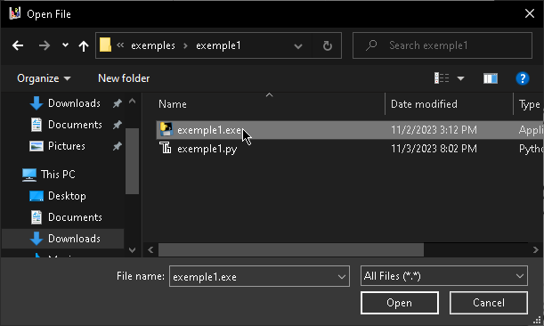

# Tetris-bot-CompKSI
Creating a tetris bot using the game engine up above

# How it works 
go to gameEngine/tetrixGameEngine.exe

then select the start it should open a windows where u select you're bot.py file 

lastly you're bot should work

# How the engine commuincates with the 
The game engine will initiate the interactoin by sending the message "name:" your bot should repond with the name of the groupe.
Once the initial exchange is complete, the game will start. When a new Tetrimino piece apperas. the game engine will send the name of the piece and the name of the next piece to your bot than your bot must respond with a list of actions. THe possible actions are as follows:
-MR: Move the piece to the right
-ML: Move the piece to the left
-RR: Rotate the piece to the right
-RL: Rotate the piece to the left
-D: Drop the piece down

# useful links

- official KSI website - (https://studentassistance.kernelsi.com/devcamp1.php)